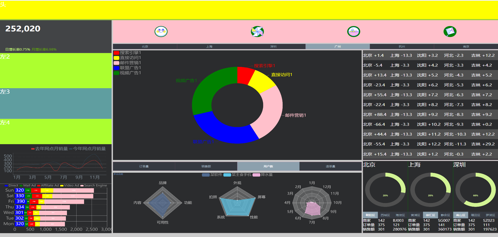

# vue2-echarts

<p align="center">
    
</p>

<p align="center">
  <a href="https://github.com/vuejs/vue">
    
  </a>
  <a href="https://github.com/ElemeFE/element">
    
  </a>
  <a href="https://travis-ci.org/PanJiaChen/vue-element-admin" rel="nofollow">
    
  </a>
  <a href="https://github.com/PanJiaChen/vue-element-admin/blob/master/LICENSE">
    
  </a>
</p>

## 简介

**项目用到 Vue2.6 + vue-router3.1.2 + echarts4.9.0重构完啦！**

## 效果图



## 前端主要技术

- vue: ^2.6.12
- axios: ^0.21.0
- echarts: ^4.9.0
- sass: ^1.29.0

## Build Setup

```bash
# clone the project
git clone https://github.com/Zore-One/vue2-echarts.git

# enter the project directory
cd vue2-echarts

# install dependency
npm install

# develop
npm run serve
```
## Browsers support

Modern browsers and Internet Explorer 10+.

| [](https://godban.github.io/browsers-support-badges/)</br>IE / Edge | [](https://godban.github.io/browsers-support-badges/)</br>Firefox | [](https://godban.github.io/browsers-support-badges/)</br>Chrome | [](https://godban.github.io/browsers-support-badges/)</br>Safari |
| --------- | --------- | --------- | --------- |
| IE10, IE11, Edge | last 2 versions | last 2 versions | last 2 versions |

## License 

[MIT](https://github.com/Zore-One/vue2-echarts/blob/main/LICENSE)

Copyright (c) 2021-present Zore-One
